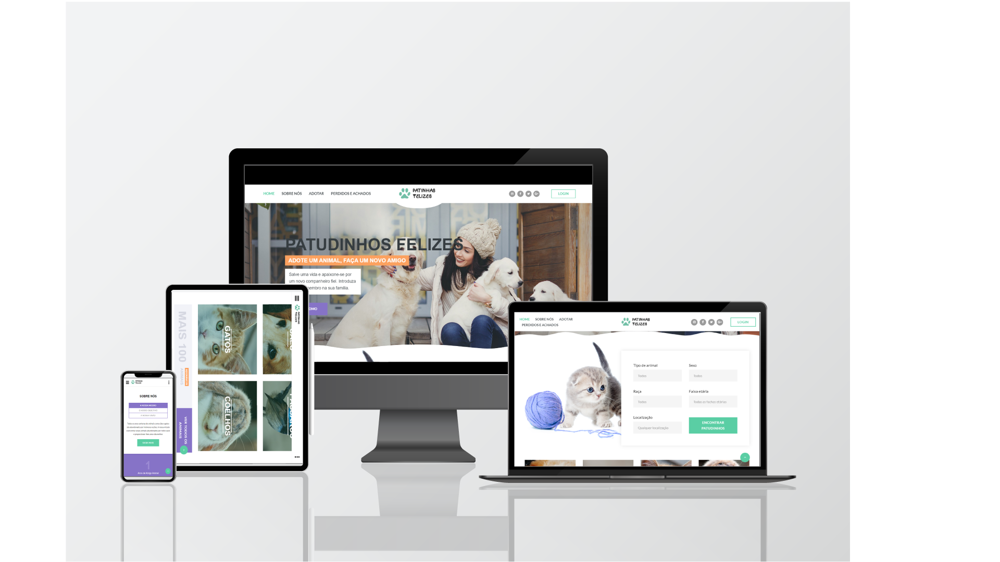
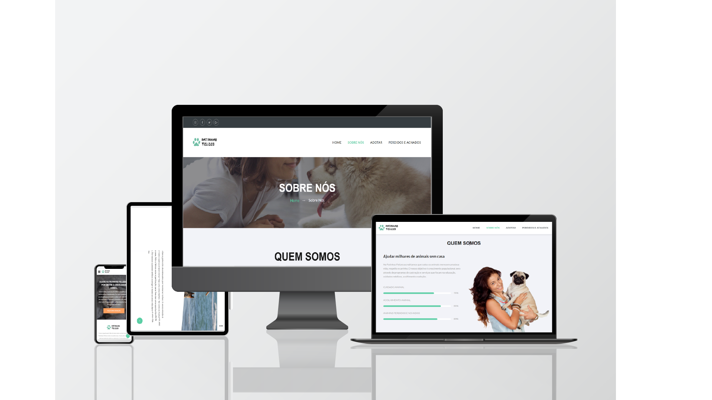
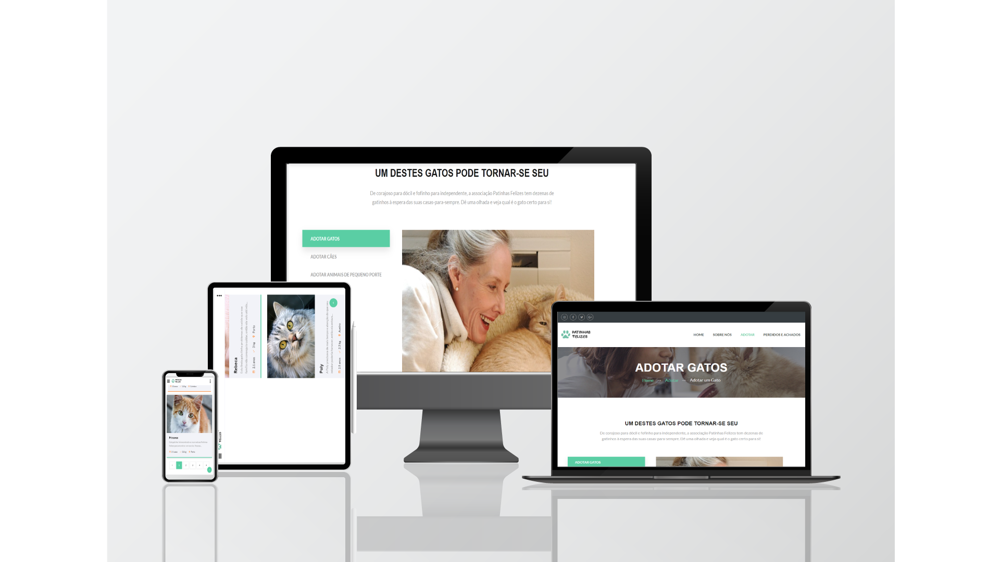
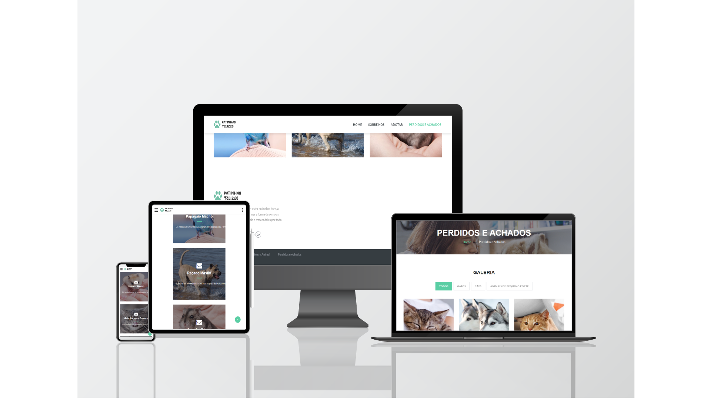
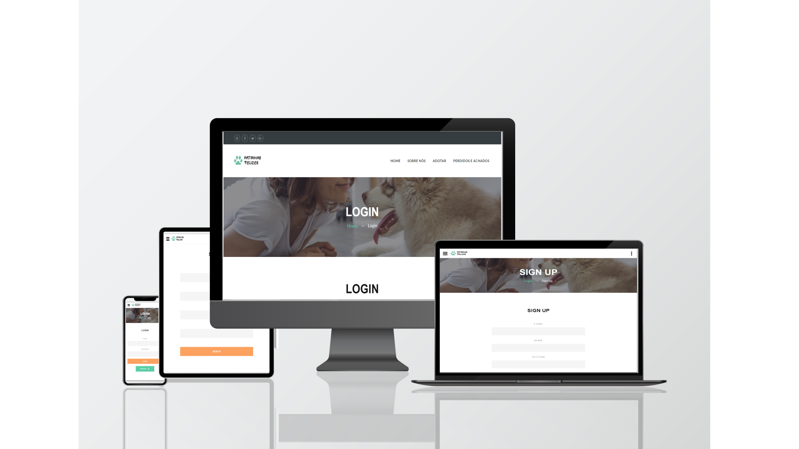
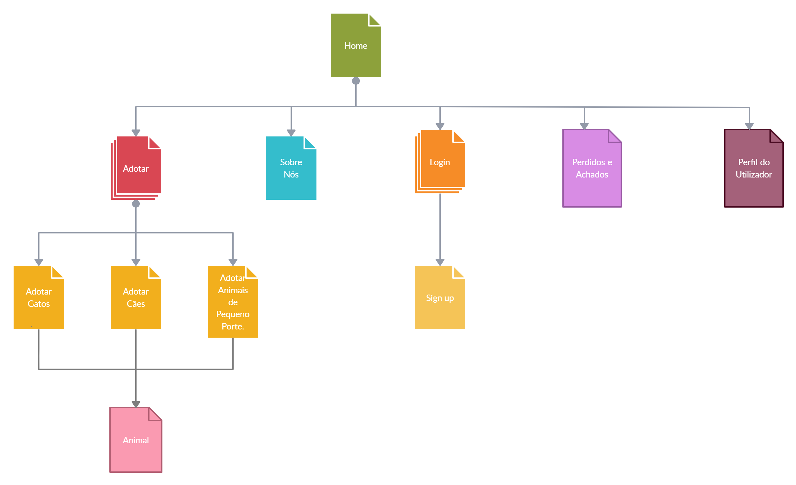
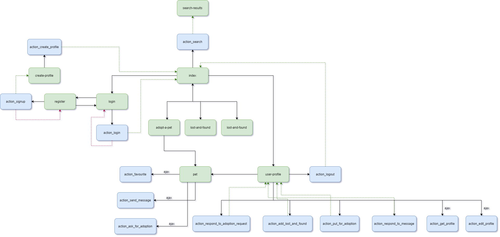
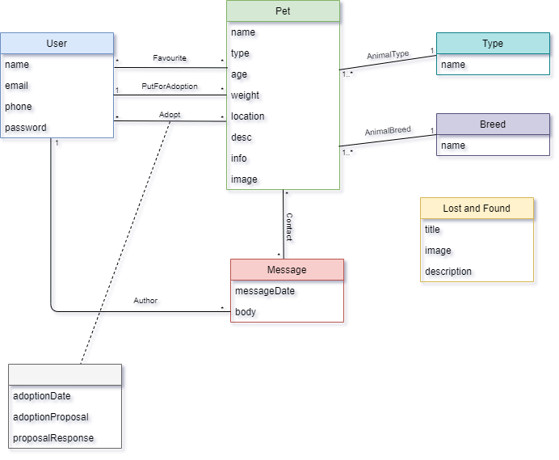

# ltw-project-g26 Documentation

Welcome to the documentation pages of the ltw-project-g26!

* Project Description
  * [Overview](#Overview)
  * [Mockups](#Mockups)
* Navigation and Database
  * [Navigation Diagrams](#Navigation-diagrams)
  * [Database Diagram](#Database-diagrams)

Designed and developed with ♥ by Tiago Lima Rocha:
* [Tiago Filipe Lima Rocha](https://github.com/SnarkyTohgo)

--- 

## Overview 
A website where users can list rescue pets for adoption and/or offer them a forever home. End goal is to project a safe and secure platform for people to search for, or post animals who need rescuing as well as negotiate the adoption proccess. 

All the code is to be donated to shelter and animal protection institutions.

--- 

## Mockups

### Home

### Sobre Nós

### Adotar

### Perdidos e Achados

### Login | Sign up

--- 

## Navigation and Database

### Navigation diagrams

### Database diagrams

--- 